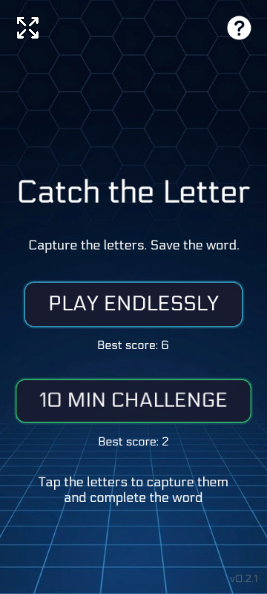
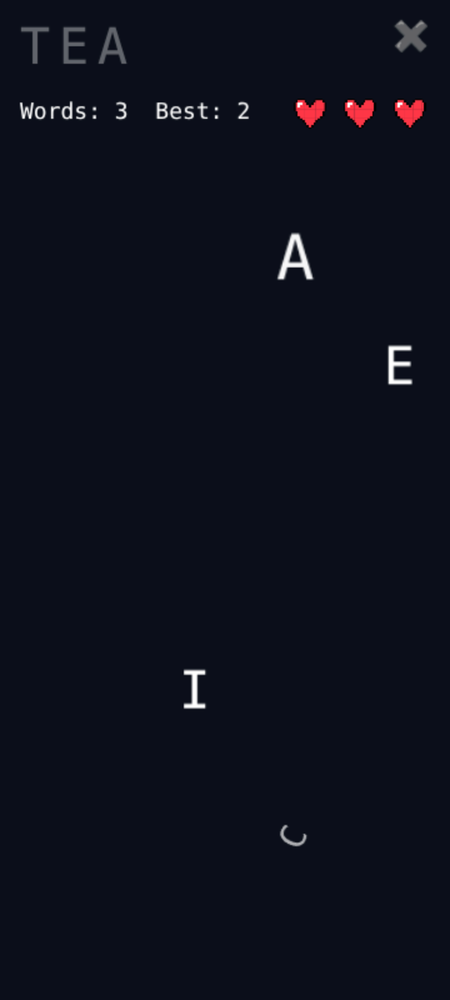
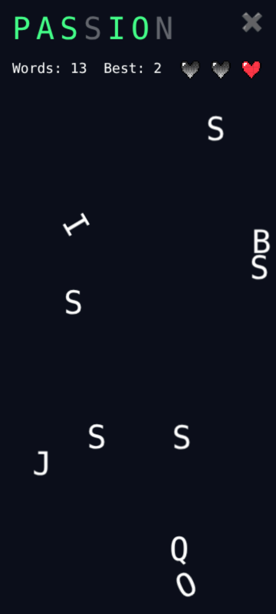
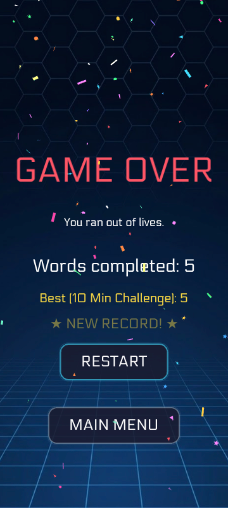

# Catch the Letter

*[Patch Notes](/patch-notes/PATCH_NOTES.md)*

A fast-paced arcade word construction game where floating letters test reaction time, precision, and spelling accuracy under pressure.

## Web Beta Play Link

The game is currently accessible via web browser:

- **Play Web Beta at**: [https://st1vms.github.io/catch-the-letter/](https://st1vms.github.io/catch-the-letter/)

*Note: Following the conclusion of the beta period, the game will be released on Android.*

## Overview

In **Catch the Letter**, target words appear at the top of the screen. Letters float around with unpredictable movements, turning the screen into complete chaos as time goes on. The objective is to tap or swipe the correct letters in sequence to complete each word before running out of lives.

## Mechanics & Rules

- **Target Words**: Displayed continuously at the top of the interface.
- **Life System**: Starts with three hearts representing available lives.
- **Penalty Triggers**: Losing a life occurs when tapping an incorrect letter or tapping a duplicate letter that was already captured.
- **Dynamic Movement**: Letters move randomly and rapidly accelerate density during late-game play.

## Game Modes

- **Play Endlessly**: Test limits by surviving as long as possible without losing all lives.
- **10 Min Challenge**: Maximize completed words within a strict 10-minute limit.

High scores and completed word counters persist between runs.

## Screenshots

| Main Menu | Early Game |
| :---: | :---: |
|  |  |

| Late Game Chaos | Game Over |
| :---: | :---: |
|  |  |
